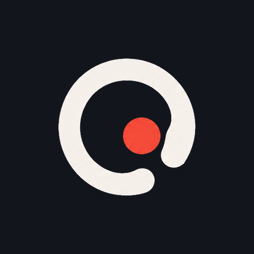
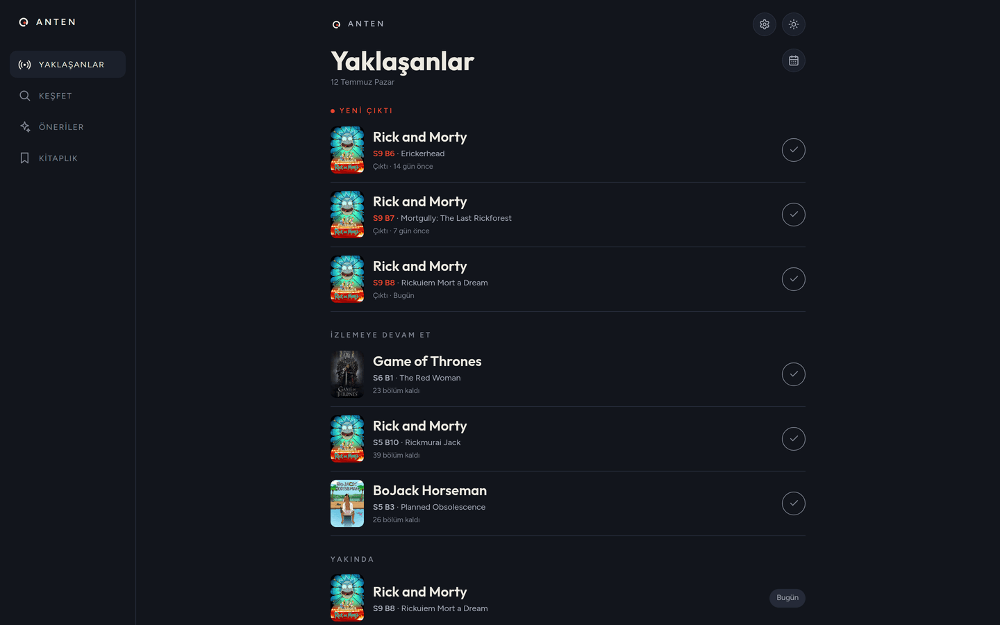
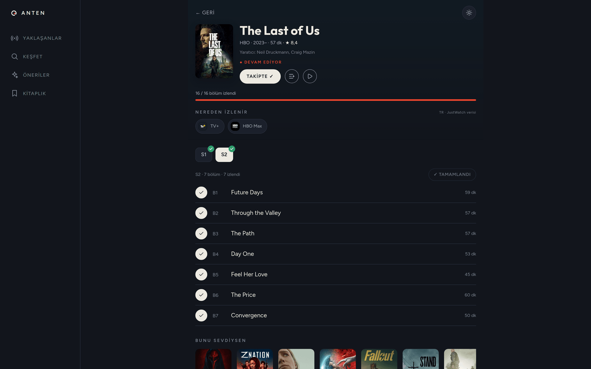
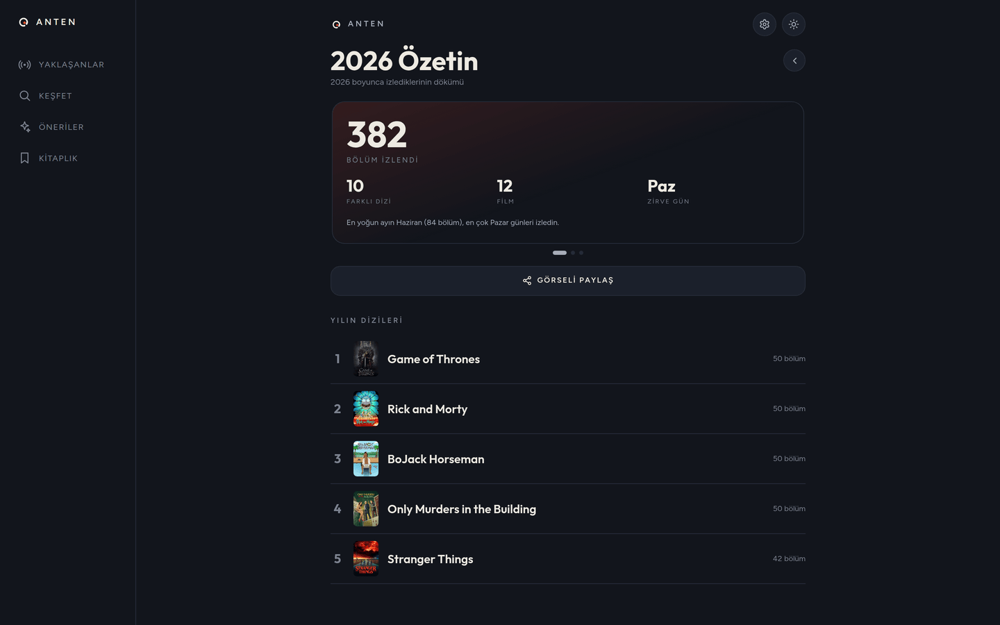
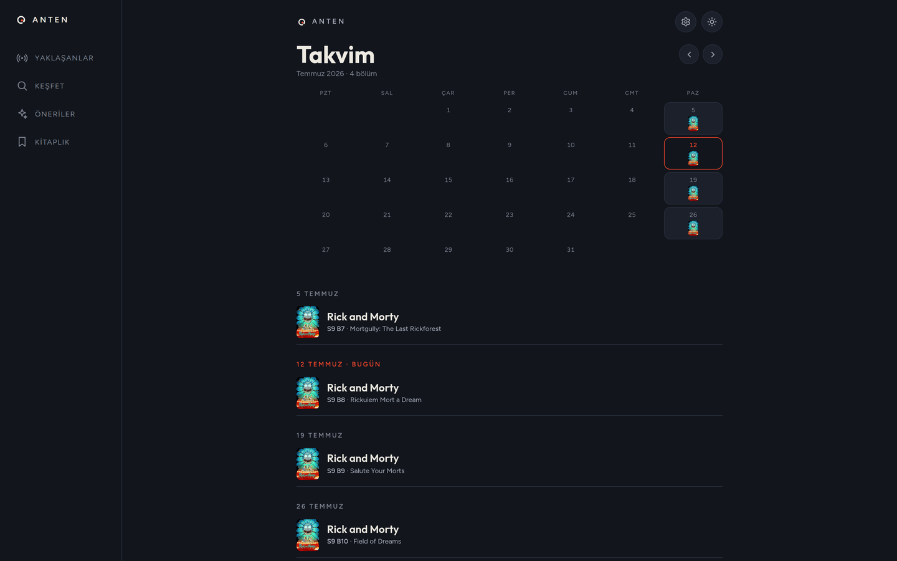
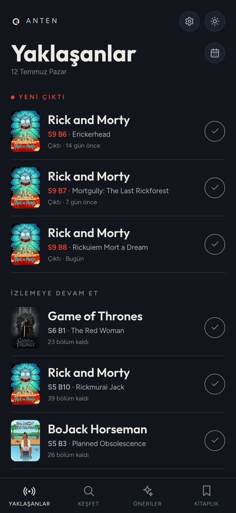
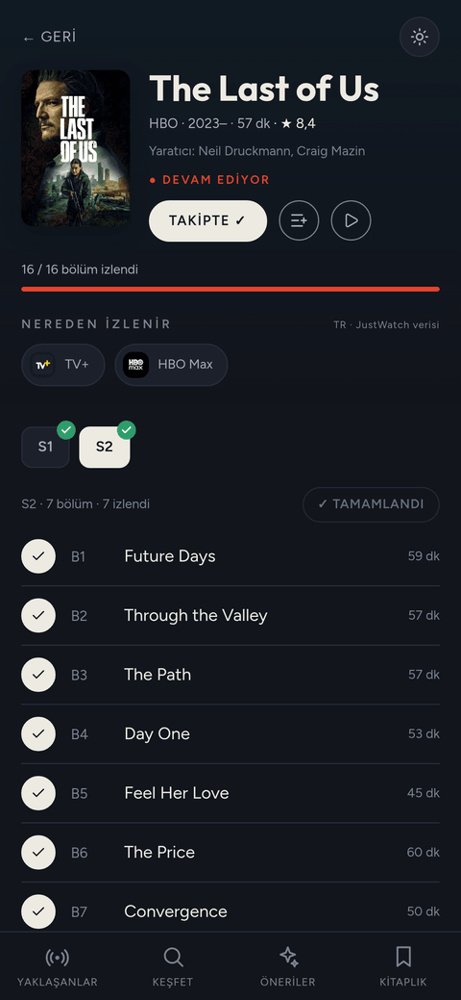
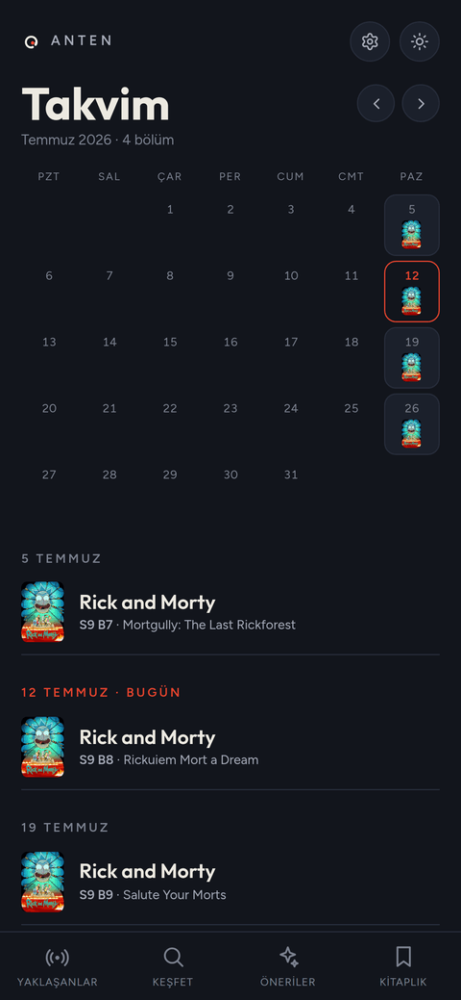

# Faruk Kılınç

Computer engineer in Ankara. I design and ship web products end-to-end: product spec, data model, UI, deployment, and the operations work after launch.

I build with AI coding agents (Claude Code), and I'm open about that — the architecture, the product decisions, and the quality bar are mine; the agents just type faster than I do. Anten, below, is what that looks like in practice.

  
  

---

## Anten — [anten.watch](https://anten.watch) 

TV show and movie tracker, built to replace TV Time. Live and free. Solo project: I wrote the product spec, designed the Postgres schema, built the UI, and run it in production.

- Episode-level tracking, release calendar, discover and recommendations, yearly watch stats
- One-click import of your full TV Time history
- English, Turkish and Spanish (next-intl); installable as a PWA
- Next.js 16 App Router with Server Components, strict TypeScript, Supabase Postgres behind row-level security, Tailwind + shadcn/ui
- TMDB metadata is synced into Supabase by a rate-limited cron; the app itself never calls TMDB

  
  

  
  

  
  
  

---

## Other projects

- **[NomadCraftAtelier](https://nomadcraftatelier.com)** — headless e-commerce storefront for a handcrafted jewelry brand. Next.js 14, Shopify Storefront API, Vercel.
- **Medusa AI tools** — product-image generation tooling for a jewelry brand. fal.ai, Anthropic API.
- **B2B jewelry marketplace** — customers design jewelry with AI, production and fulfillment are handled for them. Next.js 14, Supabase, fal.ai. In development.

Also in development: a travel-planning mobile app (React Native, Supabase) and a restaurant-operations SaaS (Next.js, PWA).

---

## Background

| Role | Where | When |
|------|-------|------|
| Independent product developer | Self-employed | 2025 – present |
| Business analyst | AloTech — cloud contact-center SaaS | 2023 – 2025 |
| IT intern | MAN Türkiye | 2022 |

B.Sc. Computer Engineering (English program), Ankara Yıldırım Beyazıt University.

Day to day: Next.js, React, TypeScript, Tailwind, Supabase/Postgres, Vercel, Claude Code. Shopify Storefront API and fal.ai where the project calls for it.
